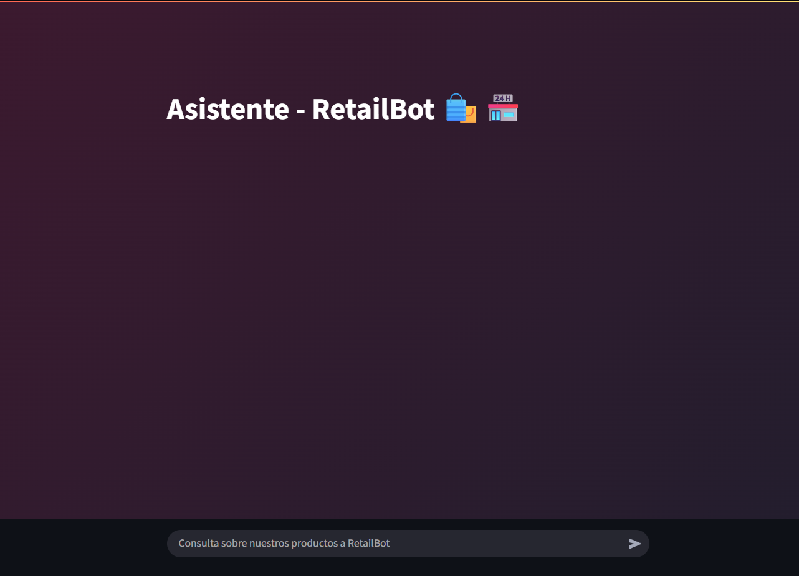

# 🛍️ Asistente Conversacional - RetailBot

Este proyecto presenta un **asistente de compras inteligente** orientado al sector **retail**, desarrollado en **Python** con **Streamlit** y **GPT-4o-mini** (modelo de OpenAI).  

---

## 🧠 Descripción

El asistente permite mantener una conversación natural con el usuario, **recordando el contexto** de la interacción y **recomendando productos** de forma breve y amigable.  
Al concluir una compra, el sistema **envía un resumen del pedido** al correo electrónico proporcionado por el usuario.  

El modelo utiliza un **pequeño RAG simulado**, integrando directamente el inventario de productos y precios dentro del contexto conversacional, junto con un conjunto de **reglas personalizadas** que guían el comportamiento del asistente.

---

## 🧩 Interfaz del asistente

